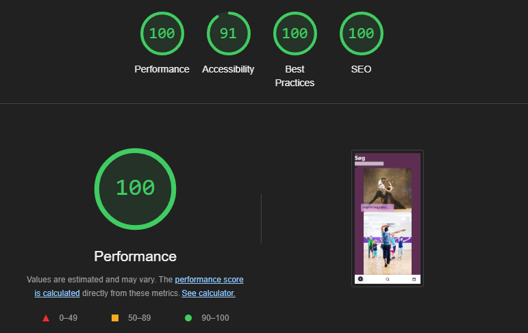

# Landrup Dans

Christian Tuyen
WU11

# Projektstyring
* ClickUp

Jeg har brugt ClickUp, til at lave Kanban board, hvor jeg holder styr på projektets fremskridt.

Link til Kanban board: [ClickUp](https://sharing.clickup.com/9015153140/b/h/4-90152965087-2/4fb77f1f81e2068)

# Tech-stack

* NextJS

NextJS er et framework i React. Det giver adgang til serverside-rendering, samt fil- og mappe-baseret routing. 
* Zod
* TailwindCSS
 

* React-icons

React-icons er et React bibliotek med samling af ikoner.
[https://react-icons.github.io/react-icons/](https://react-icons.github.io/react-icons/)

## Kode-eksempel

Jeg har valgt at tage mit login komponent, da jeg havde haft mange udfordringer, men endte at jeg kunne logge ind til sidst og derudover også tjekke Kalender siden når man er logget på. Kalender siden kan ikke ses før man er logget ind. 

*Uden at havet stylet så meget.

```javascript
    "use client"
// Taget fra gennemgang af terminsprøve
import Login from "@/actions/login"
import { useActionState, useEffect } from "react"

export default function LoginForm() {
    const [formState, formAction] = useActionState(Login)

    useEffect(function () {
        console.log("formState", formState)
    }, [formState])


    return (
        <div className="h-screen bg-cover bg-center bg-[url('/splash-image.jpg')]">
            <form action={formAction} className="flex flex-col items-center h-screen">
                <div className="grid p-[10px] m-auto">
                    <label>
                        <h1 className="font-bold text-md">Log ind</h1>
                        <span className="flex flex-col"></span>
                        <input type="text" name="username" placeholder="brugernavn" className="w-[100%] h-12 p-2 text-base" />
                    </label>
                    <span>{formState?.errors?.username?._errors}</span>
                </div>
                <div className="grid">
                    <label>
                        <span className="flex flex-col"></span>
                        <input type="password" name="password" placeholder="password" className="w-[100%] h-12 p-2 text-base" />
                    </label>
                    <span>{formState?.errors?.password?._errors}</span>
                </div>
                <button type="submit" className={`text-black font-semibold w-full px-4 py-2 bg-[#5E2E53] w-[40%] h-10 text-white rounded-md`}>Log ind</button>
                <span>{formState?.errors}</span>
            </form>
        </div>
    )
}
```

## Performance

Jeg har med valgt at tage performance af min søgeside efter nogle udfordringer jeg har haft med søgefunktionen, som blev løst senere henad 



## Perspektivering
Jeg valgte at bruge NextJS, da det er bygget ovenover React framework og giver en fordel at lave serverside-rendering. Det har gjort det lidt nemmere efter mappe-baseret routing og givet lidt bedre overblik for struktur.

Udover det, er det veludmærket framework med globalt "layout", hvor jeg kan implementere komponenter til alle eller specifikke sider. 

Eksempelvis har jeg anvendt et navigation til at blive brugt på bestemte sider og valgt at tage det fra på nogle få sider.

NextJS har været det framework jeg har brugt aldeles her for det sidste og fået bedre forståelse end da jeg brugte React framework alene.

Der er stadig mere jeg gerne vil prøve og forstå som jeg ikke har gået igennem før med NextJS.

**I fremtiden** kunne jeg godt fokusere på styling både på mobil og desktop versioner og have bedre forståelse hvordan elementer opbygges (som f.eks. hvor skal der styles fra for at vise hvad jeg har forestillet mig visuelt).


Jeg vil derudover også have bedre forståelse på hvordan funktioner kan fungere med hinanden mellem sider. 